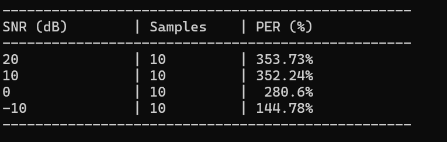

Name: Anning Ma
Student Number: 22404528
Github link: 


### Environment Setup and Initialization
The setup begins with creating a Conda virtual environment, followed by initializing the Git and DVC repositories:

```
conda create -n lab3_env
conda activate lab3_env

git init
dvc init
```
I used the dataset `sarulab-speech/commonvoice22_sidon` from Hugging Face to do this experiment. After downloading `wav` files and metadata, we track the raw data directory with DVC. This automatically configures Git to ignore the large binary assets:

```
dvc add data/raw/en/wav/

git add data/raw/en/wav.dvc data/raw/en/.gitignore
git commit -m "wav files"
```
The next step is to define the global parameters that will drive the pipeline. These variables are centralized in a `params.yaml` file. The primary parameters include the specific signal-to-noise ratio (SNR) levels, seeed and the target languages to be evaluated (for now there is only English).
```
seed: 2026
noise_levels:
  - 20
  - 10
  - 0
  - -10
languages:
  - en
```
While these parameters define the variables of the experiment, constructing a functional `dvc.yaml` pipeline requires translating the overall experiment into concrete, reproducible steps. So in the second part, we decomposed the goal into four small tasks.

### Task Decomposition

Overall, the goal is to evaluate the robustness of an Automatic Speech Recognition (ASR) system against noise. We decomposed the overall process into four sequential tasks to construct the pipeline in dvc.yaml and ensure reproducibility. To set up dvc.yaml, we need to clearly define the input and output manifests in each step.

1. Reference Phoneme Extraction
The initial step involves processing the raw reference text associated with the clean audio dataset. Utilizing the `espeak-ng` tool, the text is converted into standard phoneme sequences. 

```
'espeak-ng', '-q', '-v', lang, '--ipa=3', text
```

This stage establishes the ground truth for our evaluation, outputting the first manifest file named `clean.jsonl`.

2. Add Noise
By using function `add_noise` and `add_noise_to_file`, varying levels of background noise are artificially injected into the original clean audio signals. This data augmentation step generates the noisy audio files and compiles their metadata, along with the corresponding SNR values, into a second manifest file named `noisy.jsonl`.

3. Model Inference
In this stage, we load the pre-trained acoustic model `facebook/wav2vec2-lv-60-espeak-cv-ft` into the environment. 
```
processor = Wav2Vec2Processor.from_pretrained('facebook/wav2vec2-lv-60-espeak-cv-ft')
model = Wav2Vec2ForCTC.from_pretrained('facebook/wav2vec2-lv-60-espeak-cv-ft')
```

The pipeline feeds the previously generated noisy audio samples (listed in the noisy.jsonl file) into the model, and the model outputs the phoneme predictions. The predictions are then recorded and saved to a third manifest file named results.jsonl.

4. Performance Evaluation
The final step compares the ground truth phonemes extracted by `espeak-ng` against the model's predicted phonemes. The Phoneme Error Rate (PER) is calculated to quantify the model's performance across different noise levels. The ultimate output of this stage is an evaluation matrix.

Based on the structural decomposition outlined above, the project logic was encapsulated into four Python scripts to serve as the executable stages within the DVC workflow:

- text_phoneme.py
- add_noise.py
- inference.py
- evaluation.py

### Set up `dvc.yaml` and test the DVC workflow
Once the individual scripts are developed and tested, we configure the pipeline stages in the dvc.yaml file. For each stage, we must define the execution command, input dependencies, and output files:

```
  cmd:  #command to execute
      deps: #input file paths 
        - 
        - 
      outs: #output file path
        - 
```
To seamlessly integrate the Python scripts with DVC, we update them to accept command-line arguments using `argparse`. First, the input and output paths parsed by the scripts must strictly align with the `deps` and `outs` defined in `dvc.yaml`. Second, to enable multi-language processing, a `language` argument is introduced. Finally, stage-specific parameters are added, such as `seed` in `add_noise.py`:

```
parser = argparse.ArgumentParser(description="Add noise to audio dataset.")
parser.add_argument("--manifest", type=str, required=True, help="Path to the clean.jsonl manifest file")
parser.add_argument("--out_dir", type=str, required=True, help="Output directory for noisy audio files")
parser.add_argument("--seed", type=int, default=2026,help="Random seed, to ensure consistent noise addition")
args = parser.parse_args()
```
Apparently, we also need set up `seed` and `noise_levels` as parameters in `dvc.yaml`:

```
add_noise:
    foreach: ${languages}
    do:
      cmd: python add_noise.py --manifest data/manifests/${item}/clean.jsonl --out_dir data/manifests/${item}/noisy/ --seed ${seed} 
      deps:
        - add_noise.py
        - data/manifests/${item}/clean.jsonl
      params:
        - seed
        - noise_levels
      outs:
        - data/manifests/${item}/noisy/
  ```

With all scripts and configurations aligned, we first use Git to version the codebase and parameter files:

```
git add dvc.yaml params.yaml text_phoneme.py add_noise.py inference.py evaluation.py
git commit -m "Finalize pipeline scripts and configuration files"
```
Next, we execute the entire DVC pipeline using the reproduce command:
```
dvc repro
```
Even if the pipeline execution is temporarily interrupted by errors (such as missing libraries or argument mismatches), DVC automatically caches the outputs of successfully completed stages. Once the code is fixed, re-running dvc repro will seamlessly resume the pipeline from the point of failure, avoiding redundant computations.

### Problems and Modifications
1. Mismatch between phoneme systems and alignment
During the initial execuation, the pipeline yielded unreasonably error rates:


I checked the manifest `result.jsonl`, which revealed a fundamental mismatch in the phoneme representation systems used by the ground truth and the model.

```
"ref_pho": "D'En gEt ,aUt@v h'i@3", 
"hyp_pho": "ð ɛ n ɡ ɛ t aʊ t ʌ v h ɪ ɹ
```
The ref_pho utilized an ASCII-based phonetic alphabet, which is the default output of `espeak-ng` when using the `-x` flag. In contrast, the model's predictions (hyp_pho) utilized the standard International Phonetic Alphabet (IPA). Consequently, the initial Phoneme Error Rate (PER) calculations were strictly comparing incompatible character sets, resulting in inflated error metrics.

To resolve this, the `espeak-ng` command was updated in the `text_ phoneme.py`. The -x flag was replaced with --ipa=3 (which writes IPA phonemes separated by underscores), and a string replacement operation was added to convert the underscores into spaces, aligning with the model's output format.

```
"--ipa: Write phonemes to stdout using International Phonetic Alphabet. --ipa=1 Use ties, --ipa=2 Use ZWJ, --ipa=3 Separate with _."

```
After rerunning the pipeline, the error rates remained suspiciously high. I checked `results.jsonl` again, and the manifest showed a token granularity alignment issue:
```
"ref_pho": "ðˈɛn ɡɛt ˌa‍ʊtəv hˈi‍ə", 
"hyp_pho": "ð ɛ n ɡ ɛ t aʊ t ʌ v h ɪ ɹ"
```
While both strings now used IPA, `espeak-ng` clustered phonemes together and used hidden characters like Zero-Width Joiners (\u200d) for diphthongs, whereas the model outputted strictly space-separated individual characters. To establish a fair, character-level comparison, we add a function to strip all stress marks and hidden characters, remove existing spaces, and forcefully split every individual character with a single space:

```
def clean_phonemes(text):
    if not text:
        return ""
  
    cleaned = re.sub(r'[ˈˌː.,?!;:()\[\]\u200d\u0361\u035c]', '', text)
    
    cleaned = re.sub(r'\s+', '', cleaned)
    
    return ' '.join(list(cleaned))
```
Now the tokens aligned. However, a baseline discrepancy between ref_pho and hyp_pho persisted due to inherent dialectal differences:

```
{"ref_text": "Then get out of here.", 
"ref_pho": "ðˈɛn ɡɛt ˌa‍ʊtəv hˈi‍ə", 
"hyp_pho": "ð ɛ n ɡ ɛ t aʊ t ʌ v h ɪ ɹ"}

{"ref_text": "Then get out of here.",
"ref_pho": "ðˈɛn ɡɛt ˌa‍ʊtəv hˈi‍ə", 
"hyp_pho": "ð ɛ n ɡ ɛ t aʊ ɾ ʌ v h ᵻ ɹ"}
```
n this example, the espeak-ng reference relies on British English pronunciation rules (e.g., non-rhotic endings like hˈi‍ə), while the Wav2Vec2 model heavily favors American English characteristics (e.g., the rhotic ɹ and the alveolar tap ɾ).

Although these systemic pronunciation differences artificially inflate the absolute PER value, they act as a constant baseline offset. Because I am primarily evaluating the relative performance degradation of the model across varying noise levels, this mismatch does not invalidate the final trend analysis. Therefore, I didn't apply forced accent mapping. Here is the final results:


| SNR (dB) | Samples | PER (%) |
|---------:|--------:|--------:|
| 20       | 10      | 29.1%   |
| 10       | 10      | 36.94%  |
| 0        | 10      | 52.99%  |
| -10      | 10      | 82.84%  |

2. Limitation of `espeak-ng`
After successfully validating the pipeline with English data, the experiment was expanded to include Italian, French, and Japanese datasets to test the model's multi-lingual robustness.

For the Italian and French datasets, the pipeline produced results consistent with those observed in English:

**French:**
| SNR (dB) | Samples | PER (%) |
|---------:|--------:|--------:|
| 20       | 15     | 15.19%   |
| 10       | 15      | 19.45%  |
| 0        | 15      | 51.37%  |
| -10      | 15      | 82.25%  |

**Italian:**
| SNR (dB) | Samples | PER (%) |
|---------:|--------:|--------:|
| 20       | 15     | 35.19%   |
| 10       | 15      | 38.52%  |
| 0        | 15      | 54.83%  |
| -10      | 15      | 86.57%  |


However, the Japanese dataset had an unseasonably high PER, rendering the metrics virtually unusable for that language. The primary reason for this failure lies in the orthographic limitations of the tools used: `espeak-ng cannot` correctly identify the specific readings of Kanji characters, often defaulting to English-style character descriptions or incorrect phonetic approximations.

Japanese；
| SNR (dB) | Samples | PER (%) |
|---------:|--------:|--------:|
| 20       | 11     | 82.49%   |
| 10       | 11      | 83.85%  |
| 0        | 11      | 89.31%  |
| -10      | 11      | 95.68%  |

3. The limited data size
Because of the time constraints, the sample size for each language was limited to approximately 10 to 20 audio samples. Consequently, the dataset is relatively small, which may result in PER values that lack full statistical significance.

However, despite the limited data volume, we can observe a clear and consistent trend: as the noise level increases (and the SNR decreases), the PER rises.

### Final Result
The experimental results are consolidated into two comparative tables. 

Table 1 highlights how each language reacts to increasing noise. While French starts with the lowest error rate at 20dB, it shows the highest sensitivity to noise, with its PER surging significantly as the SNR drops to -10dB.

Tbale 2 offers a cross-linguistic view at specific noise intervals.

**TABLE 1 :**

| Language   |    20 |    10 |     0 |   -10 |
|:-----------|------:|------:|------:|------:|
| en         | 29.1  | 36.94 | 52.99 | 82.84 |
| fr         | 15.19 | 19.45 | 51.37 | 89.25 |
| it         | 35.76 | 38.52 | 54.83 | 86.57 |
| ja         | 82.49 | 83.85 | 89.31 | 95.68 |

**TABLE 2 :**

|   snr_db |    en |    fr |    it |    ja |
|---------:|------:|------:|------:|------:|
|       20 | 29.1  | 15.19 | 35.76 | 82.49 |
|       10 | 36.94 | 19.45 | 38.52 | 83.85 |
|        0 | 52.99 | 51.37 | 54.83 | 89.31 |
|      -10 | 82.84 | 89.25 | 86.57 | 95.68 |


The complete source code, including the DVC pipeline configuration, has been uploaded to GitHub for review and reproducibility.


